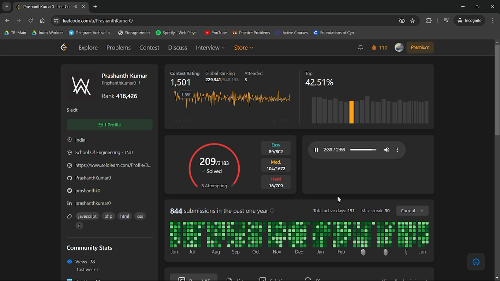

# Leetcode Music Player

<figure>
    
    <figcaption>Turn Leetcode into a cool music visualizer</figcaption>
</figure>

## How To Run 

- open your profile page 
- open dev console after page is properly loaded \[IMPORTANT\]
- copy [script.js](./script.js) and paste on dev console

> Thats it Enjoy 😀.

## Changing Music
- There's a little proxy server [server.js](./server.js) that serves the music file enabling cors to any origin.
- just spin up that server and change line 1 in [script.js](./script.js) to point to the music file.

> [!WARNING]
> If in near future leetcode changes its layout this script would not work.
